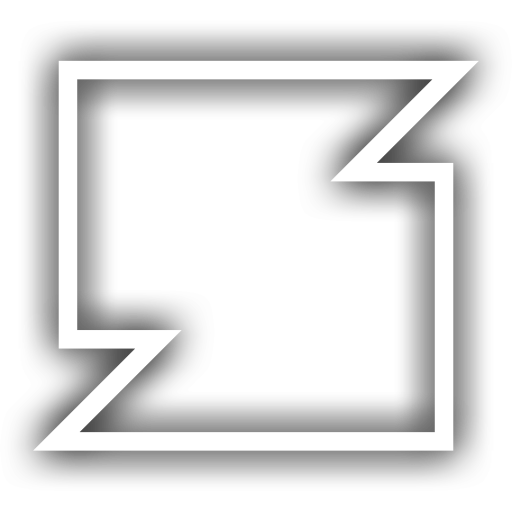

<div style="display: flex; align-items: center;">
    
    <div>
        <h1>Sh4derJockey</h1>
        <p><em>A custom VJ tool written by sp4ghet and slerpy</em></p>
    </div>
</div>

<!--


-->

## Documentation

The documentation on how to use this tool can be found in the [docs](docs/) folder or using the links below:

[Read in English](docs/readme_en.md) | [日本語で読む](docs/readme_jp.md)

## Setup

```sh
# clone the repo
git clone https://github.com/slerpyyy/sh4der-jockey.git
cd sh4der-jockey

# build and run
cargo run

# install so you can run it from anywhere
cargo install --path .
```

| ⚠️ | Please note that the tool may drop config files in the folder where the executable is located. |
|-|-|

## License

This project is licensed under either of

 * Apache License, Version 2.0
   ([LICENSE-APACHE](LICENSE-APACHE) or http://www.apache.org/licenses/LICENSE-2.0)
 * MIT license
   ([LICENSE-MIT](LICENSE-MIT) or http://opensource.org/licenses/MIT)

at your option.

This program makes use of [NDI®](https://www.ndi.tv/) (Network Device Interface), a standard developed by [NewTek, Inc](https://www.newtek.com/).

Please refer to https://www.ndi.tv/ for further information about this technology.

## Contribution

Unless you explicitly state otherwise, any contribution intentionally submitted
for inclusion in the work by you, as defined in the Apache-2.0 license, shall be
dual licensed as above, without any additional terms or conditions.
